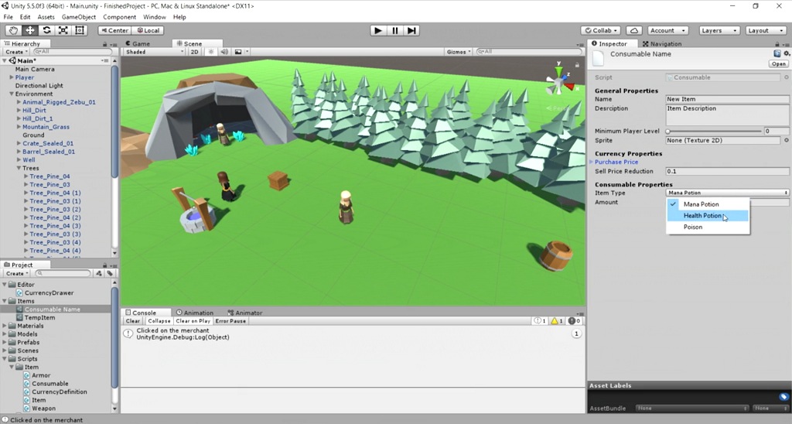

# Inventory and Store System - Part 2 (Scriptable Objects)

In this [episode](https://channel9.msdn.com/Shows/dotGAME/Item-System-Part-2-Scriptable-Objects), we'll continue our project by building a foundation for our item system using Scriptable Objects. We'll also look at some of the ways that we can modify the Unity Inspector, such as changing the layout of arrays, adding headers, and altering control types.

# Where is the starter project?
This episode is part of a series. You can use the "Finished Project" from the [Unity Navigation - Pt 2](../../1-2016/UnityItemSystemPt1) episode as the starting project.

# Challenge
This episodes challenge is to convert the Currency enum in `CurrencyDefinition` to be a Scriptable Object. At a minimum it should have Name and Sprite properties. 

# Resources

* [MonoBehavior Talk at DotNetConf](https://channel9.msdn.com/Events/dotnetConf/2016/Introducing-C-Developers-to-Building-Games-with-Unity-For-the-Hobby-Developer)
* Scriptable Object [Manual](https://docs.unity3d.com/Manual/class-ScriptableObject.html) & [API](https://docs.unity3d.com/ScriptReference/ScriptableObject.html)
* [Property Drawers](https://docs.unity3d.com/Manual/editor-PropertyDrawers.html)

# Credit

This project uses the following assets:

* [Low Poly: Free Pack](https://www.assetstore.unity3d.com/en/#!/content/58821) by AxeyWorks
