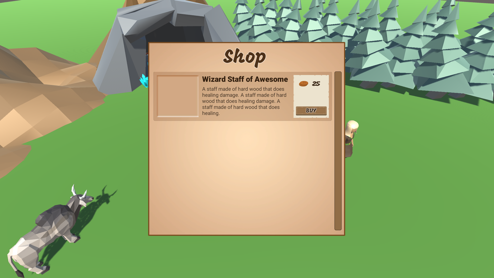
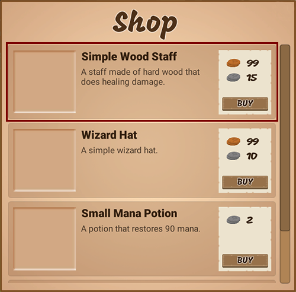

# Inventory and Store System - Part 3 (Creating the Store UI)

In this [episode](https://channel9.msdn.com/Shows/dotGAME/Inventory-and-Store-System-Part-3-UI), we'll continue our project by building out the store user interface for our player to interact with. We'll go over the foundation needed to work with the UI system in Unity, including examining the Rect Transform and components such as; Canvas, Canvas Scaler, Image, Text and more.

**Note**: In the brief time between the recording of this vidoe and the start of GDC, Unity has [announced](https://blogs.unity3d.com/2017/02/28/updates-from-unitys-gdc-2017-keynote/) that they have obtained an asset from the market called [TextMesh Pro](https://www.assetstore.unity3d.com/en/#!/content/84126) and made it free. This can significantly improve the issues that I mention in the video around text.

# Where is the starter project?
This is part of a series. You can use the "Finished Project" from the [Inventory and Store System - Part 2](../UnityItemSystemPt2-ScriptableObjects) episode as the starting project.

# Challenge
The challenge for this episode is to create your own version of the `Store_Item_Container` game object:

# Resources

* [UI Manual](https://docs.unity3d.com/Manual/UISystem.html)
* [Designing UI for Multiple Resolutions](https://docs.unity3d.com/Manual/HOWTO-UIMultiResolution.html)
* [Auto Layout](https://docs.unity3d.com/Manual/comp-UIAutoLayout.html)

# Credit

This project uses the following assets:

* [Low Poly: Free Pack](https://www.assetstore.unity3d.com/en/#!/content/58821) by AxeyWorks
* [Roboto](https://fonts.google.com/specimen/Roboto) and [Mogra](https://fonts.google.com/specimen/Mogra) Fonts
* [UI Pack: RPG Expansion](http://kenney.nl/assets/ui-pack-rpg-expansion) by Kenney
